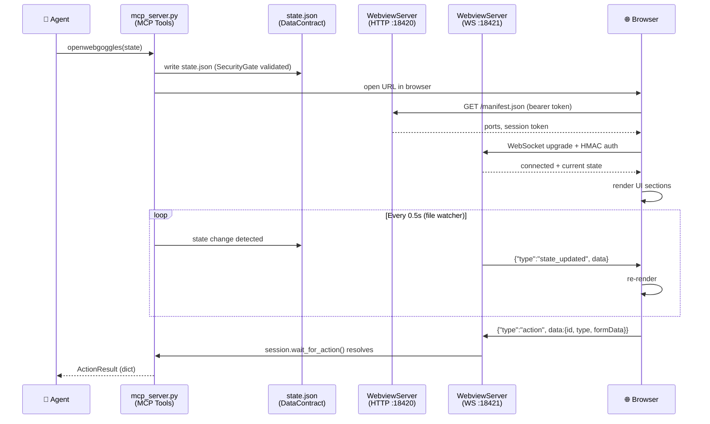
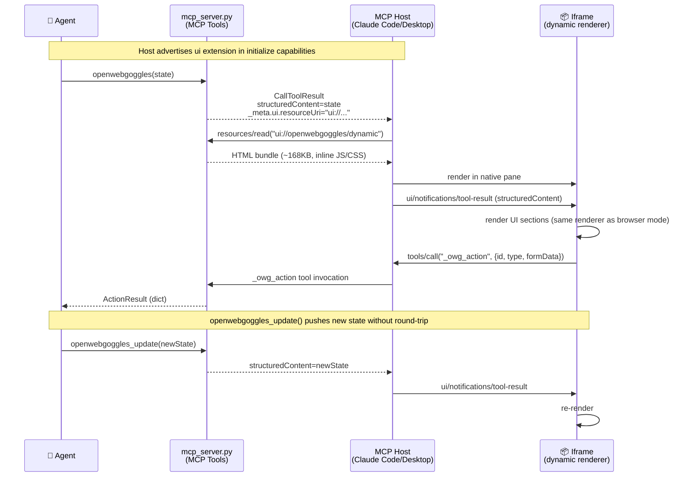
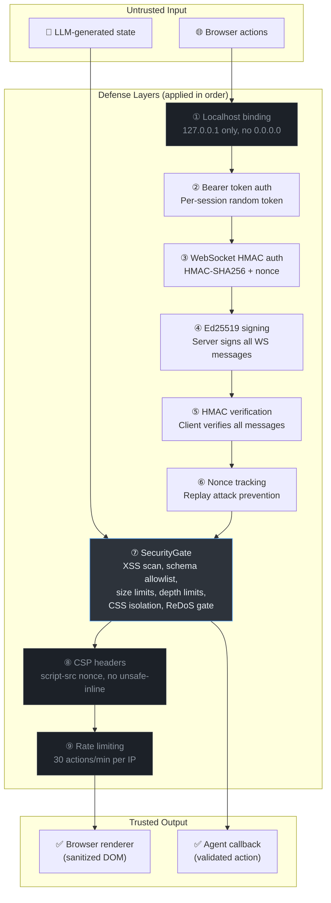
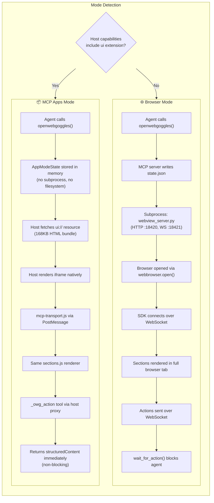
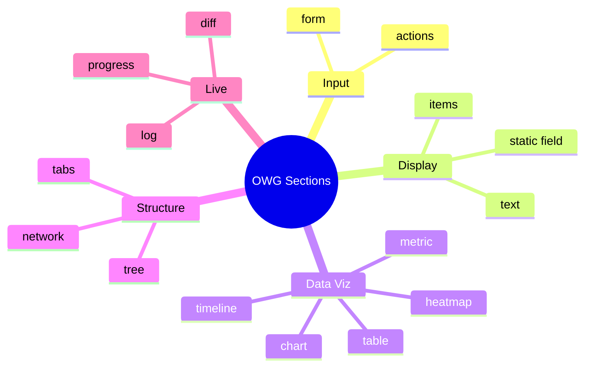

# OpenWebGoggles — Architecture

This document covers the internal architecture of OpenWebGoggles using Mermaid diagrams.
GitHub renders Mermaid natively — no build step required.

---

## 1. Browser Mode — Data Flow

The standard flow when running in a terminal/CLI environment (Claude Code, OpenCode, etc.)
that doesn't support MCP Apps native panes.



---

## 2. MCP Apps Mode — Native Pane Flow

Used when the MCP host (Claude Code, Claude Desktop) supports the
`io.modelcontextprotocol/ui` extension. The UI renders inside a native iframe pane
rather than a browser window.



---

## 3. Security Layers (9-Layer Defense)



---

## 4. Browser Mode vs MCP Apps Mode — Side-by-Side



---

## 5. Section Type Inventory

All section types supported by the dynamic renderer:



---

## 6. File Structure

```
openwebgoggles/
├── scripts/                    Python source (NOT src/)
│   ├── mcp_server.py           MCP tools, AppModeState, presets, lifespan
│   ├── session.py              WebviewSession (subprocess lifecycle)
│   ├── webview_server.py       HTTP + WebSocket server (raw asyncio)
│   ├── security_gate.py        SecurityGate — validates all state payloads
│   ├── crypto_utils.py         Ed25519, HMAC-SHA256, NonceTracker
│   ├── bundler.py              Runtime HTML bundler for MCP Apps
│   ├── monitor.py              Version monitor + hot-reload manager
│   ├── cli.py                  CLI subcommands (init, status, doctor, dev, scaffold)
│   ├── log_config.py           Structured logging (text/JSON, rotating file)
│   ├── exceptions.py           Typed exception hierarchy (OWGError subtypes)
│   └── tests/                  2194+ tests (unit + BDD + E2E Playwright)
├── assets/
│   ├── sdk/
│   │   ├── openwebgoggles-sdk.js   Browser SDK (WS + HTTP polling)
│   │   └── openwebgoggles.d.ts     TypeScript definitions
│   ├── apps/
│   │   └── dynamic/            Built-in renderer (no build step)
│   │       ├── index.html      Entry point, CSS variables, all section styles
│   │       ├── app.js          Orchestrator — transport, render, pages, actions
│   │       ├── utils.js        Escaping, sanitizeHTML, markdown, CSS validation
│   │       ├── sections.js     All section renderers + event binding
│   │       ├── charts.js       SVG chart renderer (6 chart types)
│   │       ├── validation.js   Client-side field validation engine
│   │       ├── behaviors.js    Conditional show/hide/enable/disable
│   │       └── mcp-transport.js PostMessage JSON-RPC adapter
│   └── template/               Scaffold template for custom apps
└── .github/workflows/
    ├── ci.yml                  Unit + E2E + lint on push/PR
    ├── release.yml             Auto-create GitHub Release on v* tag
    ├── publish.yml             PyPI publish on GitHub Release
    └── security.yml            Weekly pip-audit + bandit SAST
```
